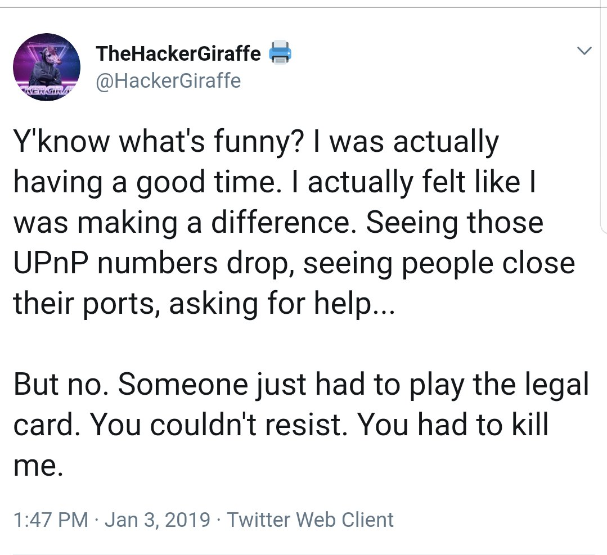
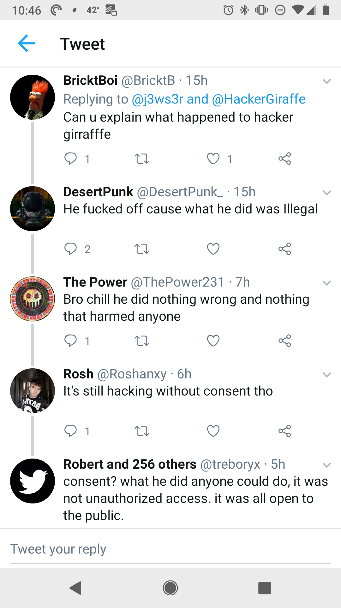
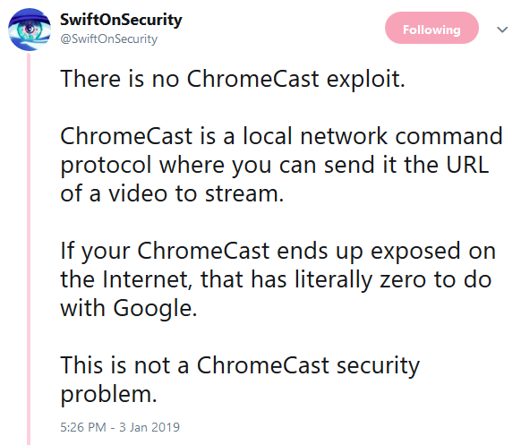

Recently, [hackers hijacked thousands of Chromecasts to warn of latest security bug](https://techcrunch.com/2019/01/02/chromecast-bug-hackers-havoc/). Once the attackers obtained access to their chromecasts they displayed a message in support of PewDiePie, the most subscribed to Youtuber. These were the same attackers behind the printer hijack a few weeks prior. PS, TechCrunch, PewDiePie is not an "awful internet person".

HackerGiraffe eventually shutdown his twitter account due to harassment and the impending legal threats he was [receiving](https://twitter.com/RachetTwitta/status/1080809552264814592/photo/1):

The following twitter thread sums up what I want to discuss nicely:

Most security professionals do not have to think twice to know that what this guy did was not only illegal, it also not an ethical thing to do.

The printer scenario is less interesting to me than the ChromeCast scenario. HackerGiraffe repeatedly claimed that he didn't create anything new. SwiftOnSecurity has a [thread](https://twitter.com/SwiftOnSecurity/status/1080998885877780480) saying:

So, is HackerGiraffe and his supporters, right? Is this something "anyone can do" therefore "it wasn't a hack" or was he in the wrong?

Of course not. This is very clearly illegal and completely ethically wrong. There is a reason responsible disclosure exists in the industry. Just because someone can open up Metasploit and scan for unprotected endpoints, connect to them, and perform unauthorized commands doesn't mean you should.

Here is an interesting thought experiment. You lock your door at night to keep out unwanted guests (i.e. intruders). A criminal comes up to your house late at night, discovers that your door is locked, breaks the lock and enters your home. This is clearly breaking and entering. If they intended on stealing your possessions, it is burglary.

Now, same situation, but the door is unlocked. The criminal encounters the unlocked door and proceeds to enter. Trespassing? Obviously not - you were asking for it by leaving the door unlocked! Let's just put it this way... If you walked into court on a trespassing charge and you said "Your honor, I didn't do anything wrong because they left the door unlocked", things would not go well for you.

(Brief note, IANAL, so please forgive me if I got something pedantically incorrect).

Making a physical analogy for an internet crime is always challenging, because things don't always transfer one to one. However, I think it is important to show the practical implications of unauthorized access and how that plays into things. The topic of intent and "force" definitely apply here.

Ultimately this comes down to the debate between white, grey, and black hats and which is the most effective. HackerGiraffe claims that he just wanted to make the world secure, but the methods to go about it were clearly immature and potentially dangerous. Why is this so important? Because there is a great legal battle going on in the United States and the world abroad on what security researchers can and can't do, and what citizens or governments can and can't do in retaliation ("hacking back"). Script kiddies who think they're making the world a better place do not help the situation, and I hope I've helped outline why what they did is in the wrong.